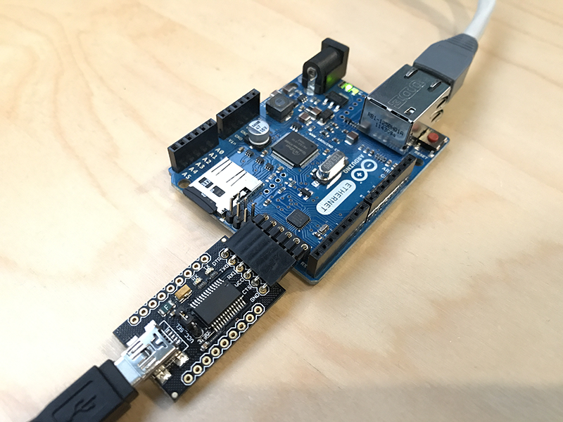

### Arduino EEPROM Read/Write



This is an implementation for reading/writing IP related information (IP Address, Subnet, Gateway and DNS) from/to Arduino EEPROM. Tested on [Arduino Ethernet](https://store.arduino.cc/usa/arduino-ethernet-rev3-without-poe) board which has 1k of EEPROM but can be adapted to other Arduino boards.

#### API Structure:
COMMAND:PARAM:VALUE

#### Available serial API:
- WRITE:IP:192.168.1.50      
- WRITE:SUBNET:255.255.255.0 
- WRITE:GATEWAY:192.168.1.254
- WRITE:DNS:192.168.1.254    
- READ:IP
- READ:SUBNET
- READ:GATEWAY
- READ:DNS
- RESTART:NET

#### Assigned EEPROM Addresses:
- IP      : 0-3
- SUBNET  : 4-7
- GATEWAY : 8-11
- DNS     : 12-15

#### Example:
```
<< Serial port COM6 opened
>> READ:IP
<< IP : 192.168.1.100
>> WRITE:IP:192.168.1.50
<< WRITE OK
>> RESTART:NET
<< RESTART OK
>> READ:IP
<< IP : 192.168.1.50
```
